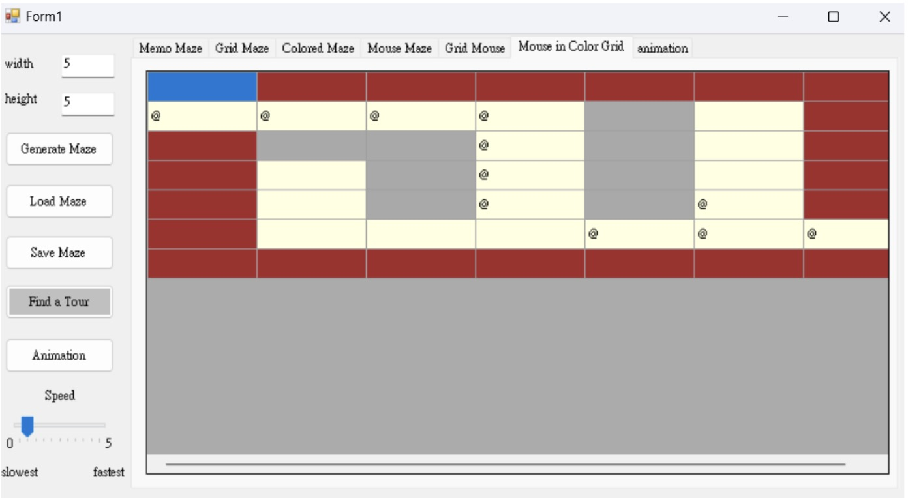
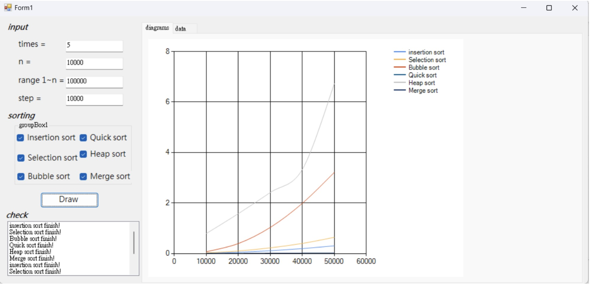
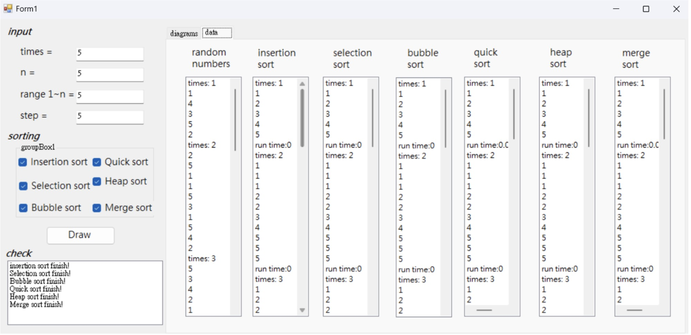

# 113年 資料結構
[link of all materials](https://sites.google.com/view/sjshyudsimf)  
想直接看code的話，可以點進每個作業裡，並找到form1.h  
每個作業的資料夾裡也都有作業的詳細執行結果，可以更清楚知道每份作業的成果如何。

## 📌 課程收穫 
透過這堂課，我學會了:  
- **C++/CLI 開發**: 使用 C++/CLI 撰寫 Windows 應用程式與主控台程式，並製作GUI介面方便使用者操作  
- **Core Data Structures**: 實作與理解linked lists, stacks, queues, trees, 和graphs等資料結構  
- **演算法最佳化**: 學習高效搜尋、排序與記憶體管理的最佳實踐方法  

## 📌作品介紹
1. bonus 1 Knight Tour
透過GUI介面，可以設定騎士的起始位置、移動速度、是否要加入顏色等等。此外，格子上除了會顯示騎士移動到每格的先後順序，更會以漸層顏色的方式填充表格（顏色越深代表越後面移動到那格）

2. HW3 Mouse in Maze
該程式可以自動生成迷宮，且也可透過動畫的方式，將老鼠走迷宮的過程呈現出來。

3. HW8 Performance Evaluation for Sorting Algorithms
該程式可以比較各種排序演算法的效率，如：insertion sort, selection sort, quick sort 和 heap sort，並透過圖像化的方式呈現給使用者

